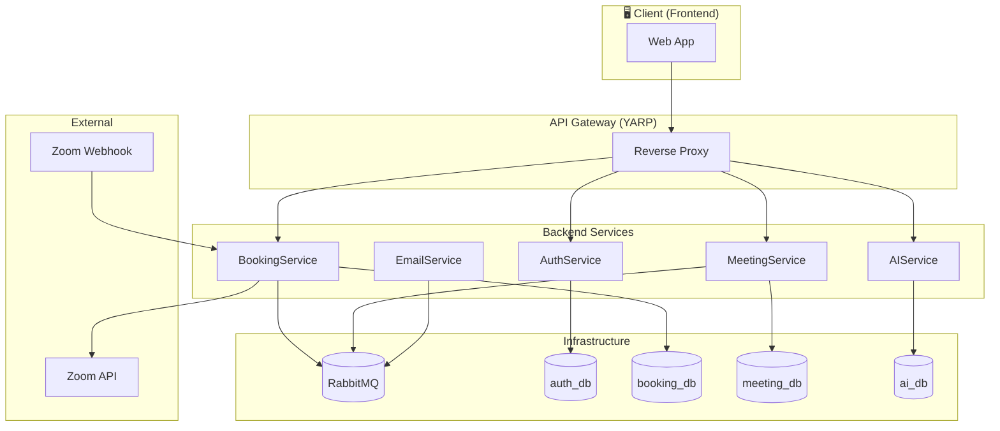
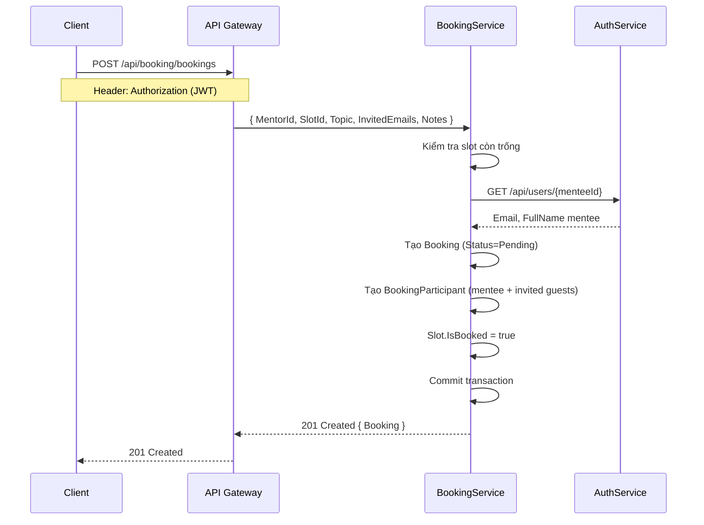
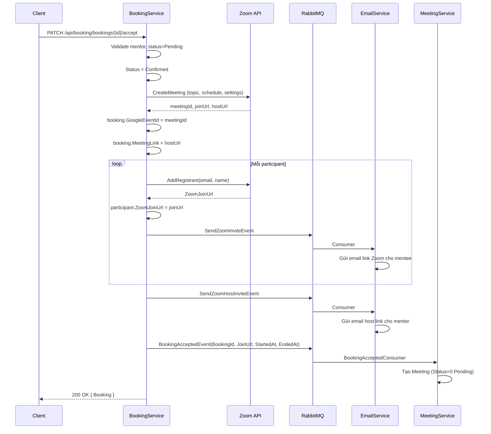
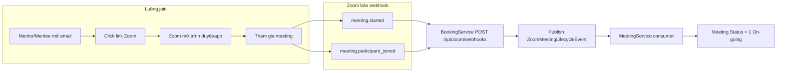
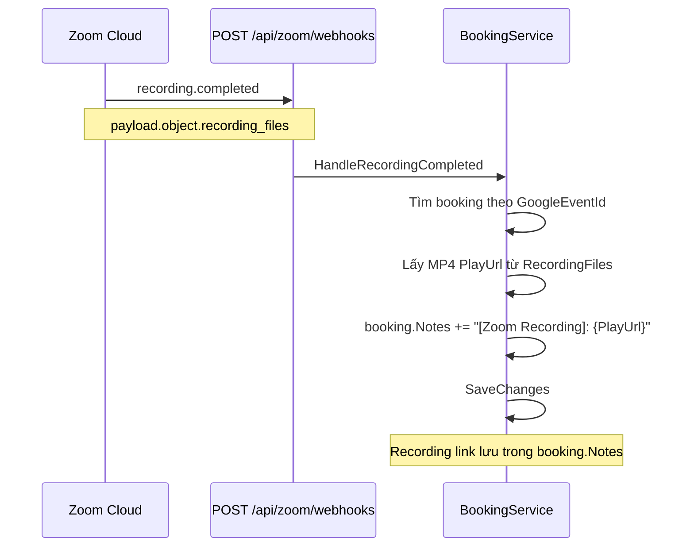
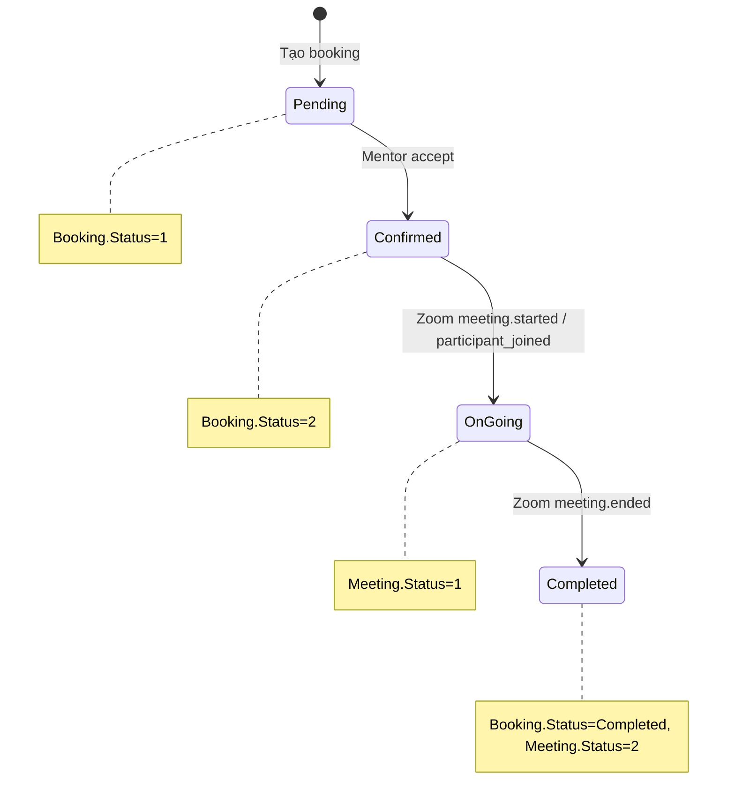

# MentorBooking — Luồng nghiệp vụ toàn hệ thống

Tài liệu mô tả chi tiết các luồng: **Tạo booking** → **Accept booking** → **Join meeting** → **Lấy recording** → **Phân tích recording** (audio-to-text, summary).

---

## 1. Tổng quan kiến trúc



---

## 2. Luồng 1 — Tạo Booking

**API:** `POST /api/booking/bookings`  
**Actor:** Mentee (sinh viên)  
**Mục đích:** Mentee chọn slot của mentor và tạo yêu cầu đặt lịch.



**Dữ liệu trả về:** `Booking` với `Status = Pending`, chờ mentor chấp nhận.

---

## 3. Luồng 2 — Accept Booking

**API:** `PATCH /api/booking/bookings/{id}/accept`  
**Actor:** Mentor  
**Mục đích:** Mentor chấp nhận → tạo Zoom meeting, gửi email invite, tạo bản ghi Meeting.



**Kết quả:**
- Zoom meeting được tạo
- Mentor và mentee nhận email chứa link join
- Meeting được tạo trong `meeting_db` với `Status = 0` (Pending)

---

## 4. Luồng 3 — Join Meeting

**Cách tham gia:** Người dùng mở **link trong email** và vào Zoom trực tiếp (không qua API).



**Lưu ý:**
- Không còn endpoint join trong MeetingService
- Link Zoom gửi qua email (`SendZoomInviteEvent`, `SendZoomHostInviteEvent`)
- Khi có người join, Zoom gửi webhook → Meeting được chuyển sang `Status = 1` (On-going)

---

## 5. Luồng 4 — Lấy Recording

Recording được Zoom cloud ghi tự động. Khi xong, Zoom gửi webhook `recording.completed`.



**Cách lấy recording trên client:**
- Gọi `GET /api/booking/bookings/{id}` → `response.Data.Notes` chứa chuỗi `[Zoom Recording]: https://...`
- Parse chuỗi để lấy PlayUrl hoặc hiển thị link tải/xem

---

## 6. Luồng 5 — Phân tích Recording (Audio-to-Text & Summary)

**Mục đích:** User tải file audio/video lên → Whisper chuyển thành text → Gemini tóm tắt.

```mermaid
flowchart TB
    subgraph Upload["Bước 1: Upload"]
        A[Client] -->|POST /api/transcripts/upload| B[AIService]
        B --> C[Lưu file LocalStorage]
        B --> D[AudioTranscript Status=Processing]
    end

    subgraph Transcribe["Bước 2: Transcribe"]
        D --> E{Video?}
        E -->|Có| F[FFmpeg tách audio → .wav]
        E -->|Không| G[Audio gốc]
        F --> H[Whisper API transcribe]
        G --> H
        H --> I[Lưu RawText, Segments]
        I --> J[Status=Completed]
    end

    subgraph Summarize["Bước 3: Summarize"]
        J --> K[POST /api/transcripts/{id}/summarize]
        K --> L[Gemini API summarize]
        L --> M[MeetingSummary + ActionItems]
        M --> N[Trả về TranscriptSummaryDto]
    end
```

### Chi tiết API

| Bước | API | Mô tả |
|------|-----|-------|
| **Upload** | `POST /api/transcripts/upload` | multipart: file (audio/video), title, sourceType. Tự động transcribe bằng Whisper, có thể summarize ngay. |
| **Xem transcript** | `GET /api/transcripts/{id}` | Chi tiết transcript + segments. |
| **Summarize** | `POST /api/transcripts/{id}/summarize` | Chạy Gemini để tóm tắt transcript, lưu MeetingSummary. |
| **Danh sách** | `GET /api/transcripts` | Danh sách transcript (phân trang). |

**Nguồn file:** User **tự upload** file recording (download từ Zoom PlayUrl rồi upload). Chưa có luồng tự động lấy file từ Zoom.

---

## 7. Sơ đồ tổng hợp end-to-end



```mermaid
flowchart TB
    subgraph Phase1["1. Tạo & Accept"]
        B1[POST /bookings] --> B2[PATCH /accept]
        B2 --> B3[Zoom meeting + Email]
        B3 --> B4[Meeting created]
    end

    subgraph Phase2["2. Join & Record"]
        B4 --> J1[User click link email]
        J1 --> J2[Zoom meeting]
        J2 --> J3[Zoom webhooks]
        J3 --> J4[Meeting Status sync]
        J2 --> R1[Zoom cloud record]
        R1 --> R2[recording.completed]
        R2 --> R3[Link in booking.Notes]
    end

    subgraph Phase3["3. Phân tích"]
        R3 --> P1[User download file]
        P1 --> P2[POST /transcripts/upload]
        P2 --> P3[Whisper → text]
        P3 --> P4[POST /transcripts/{id}/summarize]
        P4 --> P5[Gemini → summary]
    end

    Phase1 --> Phase2 --> Phase3
```

---

## 8. Bảng API tham chiếu

| Luồng | Method | Path | Service |
|-------|--------|------|---------|
| Tạo booking | POST | `/api/booking/bookings` | BookingService |
| Accept booking | PATCH | `/api/booking/bookings/{id}/accept` | BookingService |
| Lấy booking | GET | `/api/booking/bookings/{id}` | BookingService |
| Zoom webhook | POST | `/api/zoom/webhooks` | BookingService |
| Upload transcript | POST | `/api/transcripts/upload` | AIService |
| Summarize | POST | `/api/transcripts/{id}/summarize` | AIService |
| Chi tiết transcript | GET | `/api/transcripts/{id}` | AIService |
| Danh sách transcript | GET | `/api/transcripts` | AIService |

---

## 9. Message Bus (RabbitMQ)

| Event | Producer | Consumer | Mục đích |
|-------|----------|----------|----------|
| `BookingAcceptedEvent` | BookingService | MeetingService | Tạo Meeting khi accept |
| `SendZoomInviteEvent` | BookingService | EmailService | Email link Zoom cho mentee |
| `SendZoomHostInviteEvent` | BookingService | EmailService | Email host link cho mentor |
| `ZoomMeetingLifecycleEvent` | BookingService | MeetingService | Cập nhật Meeting.Status theo webhook Zoom |

**Yêu cầu:** Cấu hình `RabbitMQ:Host` trong appsettings; nếu trống thì dùng NoOp (event không gửi).
